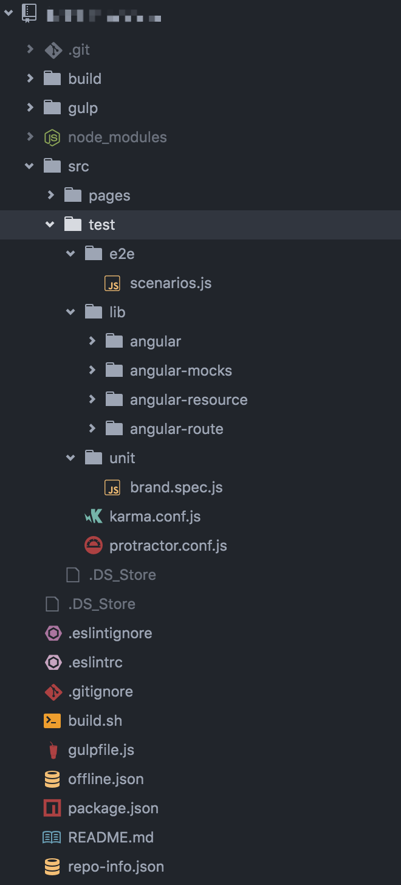

### AngularJS测试

这两天学习了一下AngularJS的测试。

#### 感想

学习《AngularJS权威教程》这本书的测试章节，大概过了一遍测试的基本知识。

通过AngularJS的官网教程，跑了一下教程上的实例的单元测试和E2E测试，中间遇上了不少问题（都是教程上列举的几个常见问题，解决方案也有啦，所以跑起来问题不大）。

试着在自己的项目里面加测试，依旧还是遇到了问题（深刻感受到自己解决问题的能力还有效率太低了，哭，这一方面还是要多多提高），不过真正在实际项目里写测试用例，还是要感觉比例子里的测试用例复杂，没咋写出来什么比较好的用例。

所以两天下来，并没有把测试真正的用在项目中，果然动手能力还有待提高啊。

#### 怎么搭建一个测试环境

测试分为单元测试和E2E测试，这两种测试我在项目中都实践了一下。

首先，先讲讲我的目录结构吧~

`page`文件存放项目的所有资源文件，`test`文件存放项目的测试文件。

##### 单元测试

##### E2E测试