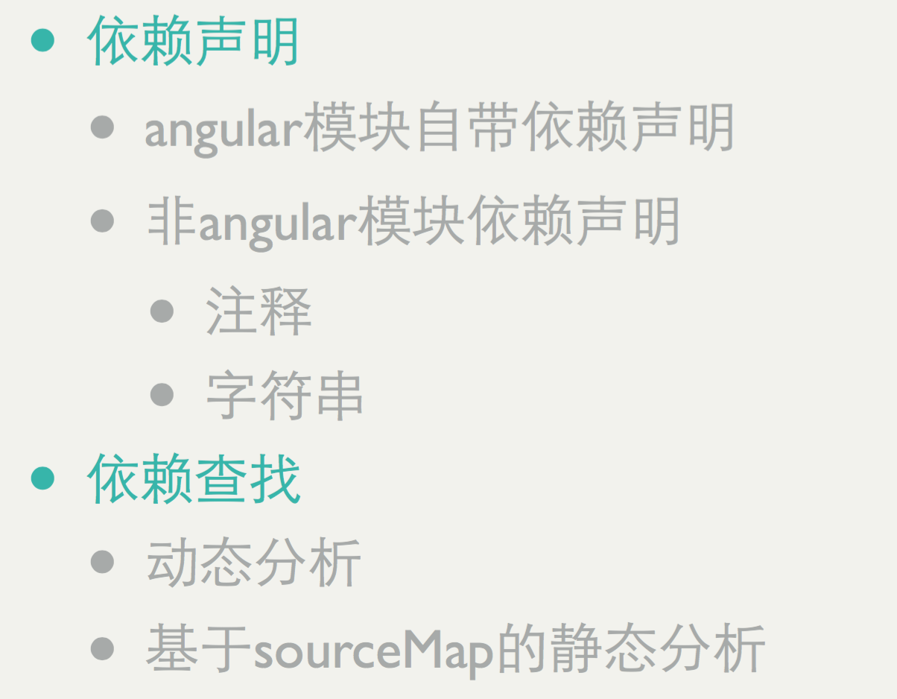
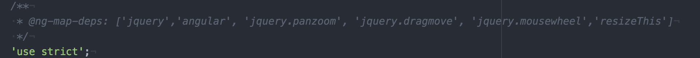
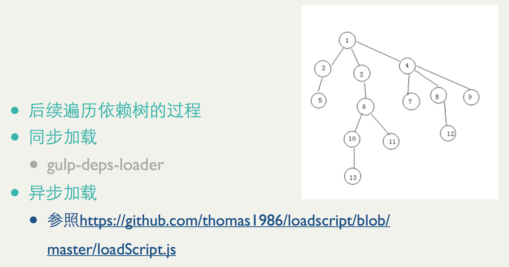
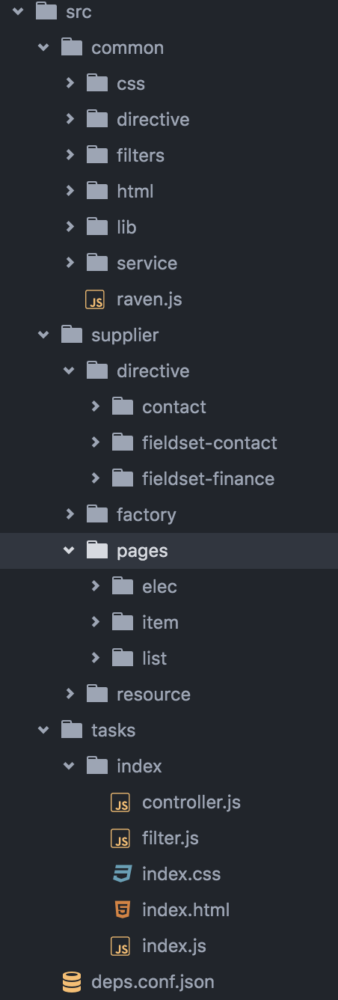
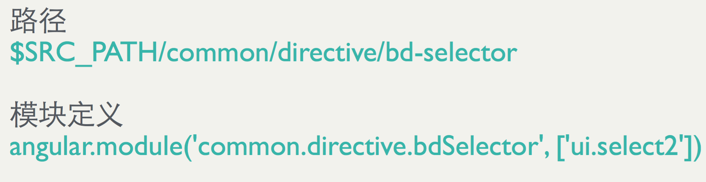
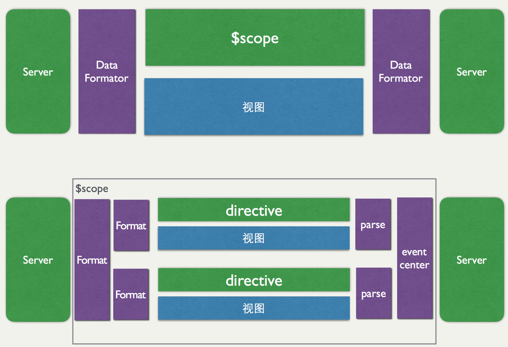
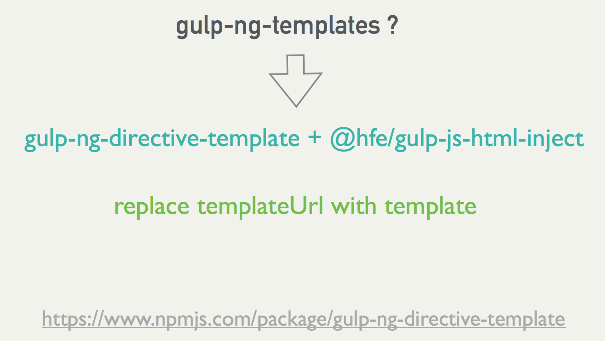
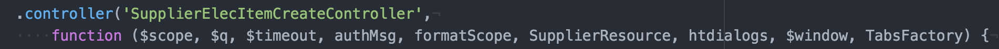

## 学习“一种基于gulp的angular解决方案”总结

听了“一种基于gulp的angular解决方案”的分享，觉得现在可以趁着项目规模比较小，将一些东西规范一下，可以方便以后的开发，于是学习了一下“一种基于gulp的angular解决方案”，讲讲感想。。。

### 感想

感触最为深刻的是不同项目，应用场景不一样，这种解决方案的应用方式也不一样，果然还是需要理解其中的思想，再根据实际来应用这种方案。

> 让工程归工程,让工程师归业务

其实，在最开始接触AngularJS开发的项目时，就一直被知道页面需要组件化和模块化。但是，在实际的工作开发过程中，接触到的项目都没有真正做到这两点，所以，作为一个Angular小白，表示很希望能够开发一个组件化和模块化的项目。

以上是想到啥写啥，有些感想可能没啥联系，哈哈

不说废话了，讲讲内容吧 ~ ~ ~

### 前端工程

前端工程这个概念刚接触不久，其实理解还是很肤浅的，用我自己的话来说的话就是项目开发、构建、部署、发布这一系列过程的问题就是前端工程领域的问题。接触这个概念是通过[大神的博客](https://github.com/fouber/blog)了解到的，这个博客有很多关于前端工程的干货，非常值得学习。

“一种基于gulp的angular解决方案”这个分享主要是讲基于AngularJS的项目依赖管理的问题的解决方案的介绍。

#### AngularJS的依赖问题

> Angular有自己的依赖管理模块，但是没有对应的自动化加载工具

> 这就导致需要引入额外的模块加载系统

> 常用的模块加载方式都需要另外定义模块依赖，手动加载、requireJS、webpack、fis* （导致模块化成本高）

> 现状是工程管理是使用gulp做的自动化

#### 解决方案

基于gulp实现一套angular自动化模块加载工具，分为两部分：

**依赖分析**

[gulp-deps-map](https://github.com/gorphone/gulp-deps-map)

> a plugin to analysis the dependance of angular module

> the ouput is a json


</img>

* 依赖声明（非angular模块依赖声明）



在根目录下创建一个**deps.conf.json**文件，如下：

```
{
    "js_default": [
        "common/lib/node_modules/jquery/dist/jquery.js",
        "common/lib/node_modules/angular/angular.js",
        "common/lib/node_modules/bootstrap/dist/js/bootstrap.js",
        "common/lib/no_npm/ht-form-validition/src/validator.js",
        "common/lib/no_npm/ht-form-validition/src/jquery.validator.js",
        "common/lib/no_npm/select2/select2.js"
    ],  
    "css_default": [
        "common/lib/node_modules/bootstrap/dist/css/bootstrap.css",
        "common/lib/node_modules/components-font-awesome/css/font-awesome.css",
        "common/css/bootstrap-ext.css",
        "common/lib/no_npm/select2/select2.css",
        "common/lib/no_npm/select2/select2-bootstrap.css"
    ],
    "alias": {
        "common/lib/node_modules/jquery/dist/jquery.js": "jquery",
        "common/lib/node_modules/angular/angular.js": "angular",
        "common/lib/node_modules/bootstrap/dist/js/bootstrap.js": "bootstrap",
        "common/lib/no_npm/ht-form-validition/src/validator.js": "validator",
        "common/lib/no_npm/ht-form-validition/src/jquery.validator.js": "jquery.validator",
        "common/lib/no_npm/select2/select2.js": "jquery.select2",
        "common/lib/no_npm/jquery.panzoom/dist/jquery.panzoom.js": "jquery.panzoom",
        "common/lib/no_npm/jQuery.dragmove/jQuery.dragmove.js": "jquery.dragmove",
        "common/lib/no_npm/resizeThis/resizeThis.js": "resizeThis"
    },
    "shim": {
        "ui.select2": {
            "deps": [
                "jquery.select2"
            ]
        },
        "ng-light-box" : {
            "deps": [
                "jquery",
                "jquery.panzoom", 
                "jquery.dragmove", 
                "jquery.mousewheel", 
                "resizeThis"
            ]
        }
    }
}
```

其中，`js_default`，`css_default`是页面默认会加载的文件。而`alias`则是通过这种方式定义非angular模块，方便其他依赖了这些模块的模块查找这些模块。`shim`则是定义了依赖了非angular模块的组件。

* 依赖查找

在tasks文件夹中创建一个gulp的task，即`deps-map.js`文件，如下：

```
'use strict';

var gulpDepsMaps = require('gulp-deps-map');
var config = require('../src/deps.conf.json');

module.exports = {
    task: function depsMap (gulp) {
        return gulp.src(
            [
                './src/**/*.js',
                '!./src/**/node_modules/**/jquery/src/**/*.js',
                '!./src/**/node_modules/**/ng-flow/src/**/*.js',
                '!./src/**/node_modules/**/ng-table/src/**/*.js',
                '!./src/**/node_modules/**/ng-toast/src/**/*.js',
                '!./src/**/node_modules/**/raven-js/src/**/*.js',
                '!./src/**/node_modules/**/examples/**/*.js',
                '!./src/**/node_modules/**/example/**/*.js',
                '!./src/**/node_modules/**/demo/**/*.js'
            ])
            .pipe(gulpDepsMaps(config))
            .pipe(gulp.dest('./public/src/'));
    }
};
```

运行这个task之后，会在`./public/src/`文件下生成一个`map.json`文件。

```
{
    "flow.provider": {
        "md5": "ff57bcde125f45a9402010f0078baecb",
        "type": "js",
        "path": "common/lib/node_modules/ng-flow/dist/ng-flow-provider.js",
        "deps": []
    },
    "flow.init": {
        "md5": "ff57bcde125f45a9402010f0078baecb",
        "type": "js",
        "path": "common/lib/node_modules/ng-flow/dist/ng-flow-init.js",
        "deps": [
            "flow.provider"
        ]
    },
    "flow.btn": {
        "md5": "ff57bcde125f45a9402010f0078baecb",
        "type": "js",
        "path": "common/lib/node_modules/ng-flow/dist/ng-flow-btn.js",
        "deps": [
            "flow.init"
        ]
    },
    "flow.dragEvents": {
        "md5": "ff57bcde125f45a9402010f0078baecb",
        "type": "js",
        "path": "common/lib/node_modules/ng-flow/dist/ng-flow-dragevents.js",
        "deps": [
            "flow.init"
        ]
    },
    "flow.drop": {
        "md5": "ff57bcde125f45a9402010f0078baecb",
        "type": "js",
        "path": "common/lib/node_modules/ng-flow/dist/ng-flow-drop.js",
        "deps": [
            "flow.init"
        ]
    },
    "flow.events": {
        "md5": "ff57bcde125f45a9402010f0078baecb",
        "type": "js",
        "path": "common/lib/node_modules/ng-flow/dist/ng-flow-events.js",
        "deps": [
            "flow.init"
        ]
    },
    "flow.img": {
        "md5": "ff57bcde125f45a9402010f0078baecb",
        "type": "js",
        "path": "common/lib/node_modules/ng-flow/dist/ng-flow-img.js",
        "deps": [
            "flow.init"
        ]
    },
    "flow.transfers": {
        "md5": "ff57bcde125f45a9402010f0078baecb",
        "type": "js",
        "path": "common/lib/node_modules/ng-flow/dist/ng-flow-transfers.js",
        "deps": [
            "flow.init"
        ]
    },
    "flow": {
        "md5": "ff57bcde125f45a9402010f0078baecb",
        "type": "js",
        "path": "common/lib/node_modules/ng-flow/dist/ng-flow-standalone.js",
        "deps": [
            "flow.provider",
            "flow.init",
            "flow.events",
            "flow.btn",
            "flow.drop",
            "flow.transfers",
            "flow.img",
            "flow.dragEvents"
        ]
    }
}
```

**依赖加载**

[gulp-deps-loader](https://github.com/gorphone/gulp-deps-loader)

> Depend on gulp-deps-map

> this plugin will load css which has the same path and name with js depended by html




在tasks文件夹中创建一个gulp的task，即`gulp-loader.js`文件，如下：

```
'use strict';

var gulpDepsloader = require('gulp-deps-loader');
var ignore = require('gulp-ignore');

module.exports = {
    deps: ['deps-map'],
    task: function depsLoad (gulp) {
        var prefixUrl = '/src/;

        // html load js & css and release
        var options = {
            map: './public/src/map.json', // map path
            js_prefix: prefixUrl, // js 加载路劲前缀
            css_prefix: prefixUrl, // css加载路劲前缀
            js_default: [
                'common/lib/node_modules/jquery/dist/jquery.js',
                'common/lib/node_modules/angular/angular.js',
                'common/lib/node_modules/bootstrap/dist/js/bootstrap.js',
                'common/lib/no_npm/ht-form-validition/src/validator.js',
                'common/lib/no_npm/ht-form-validition/src/jquery.validator.js',
                'common/lib/no_npm/select2/select2.js'
            ],  // 默认加载的js库
            css_default: [
                'common/lib/node_modules/bootstrap/dist/css/bootstrap.css',
                'common/lib/node_modules/components-font-awesome/css/font-awesome.css',
                'common/css/bootstrap-ext.css',
                'common/lib/no_npm/select2/select2.css',
                'common/lib/no_npm/select2/select2-bootstrap.css'
            ]  // 默认加载的css库
        };

        var stream = gulp.src('./src/**/*.html')
            .pipe(ignore('.**/directive/**/*.html')) // release by loader
            // .pipe(watch(['./src/**/*.html', '!./src/**/directive/**/*.html']))
            .pipe(gulpDepsloader(options));

        return stream.pipe(gulp.dest('./templates/src/'));
    }
};

```

运行这个task，会在`./templates/src/`文件下的html文件中使用`<script>`加载默认的js库和css库，同时根据`./public/src/map.json`将依赖的其他模块加载进来。而组件默认会在html文件中加载在同文件夹下的与html文件同名的js文件。

加载顺序如下：（以js文件为例）

默认加载的js库 -> 同文件夹下与html文件同名的js文件所依赖的模块（后续遍历依赖树的过程） -> 同文件夹下与html文件同名的js文件

#### 项目工程规范

##### 规范思路

* 规范目录及文件
* 精细化模块管理
* 视图组件拆分
* 规范数据流

> 拆目录 + 拆文件

> 提高内聚 + 降低耦合

**目录规范**

以页面为维度，每个页面划分为一个文件夹，其页面独有的html文件、组件、模块等资源都放在这个文件夹下。新建一个common文件夹，将项目公共的模块、组件放在这个文件夹下。如下：

</img>

**模块规范**

> 模块名即路径，路径即模块名

</img>

**文件&模块拆分**

* 单一功能原则
* 用directive拆分controller
* 基于事件通信
* 规范数据流



**templateUrl**

[gulp-ng-directive-template](https://www.npmjs.com/package/gulp-ng-directive-template)

> This plugin will replace templateUrl with template by include the file of template into the file of js in directive of angular, to reduce a http request.

</img>

在tasks文件夹中新建一个gulp的task，即`gulp-release.js`，如下：

```
'use strict';

var ignore = require('gulp-ignore');
var sass = require('gulp-sass');
var filter = require('gulp-filter');
var gulpNgDeirectiveTep = require('gulp-ng-directive-template');
var ngAnnotate = require('gulp-ng-annotate');
var inject = require('@hfe/gulp-js-html-inject');

module.exports = {
    task: function release (gulp) {
        // release other file
        var directiveFilter = filter('**/directive/**/*.js', {restore: true});
        var cssFilter = filter('**/*.css', {restore: true});
        var jsFilter = filter(['**/*.js', '!**/node_modules/**/*.js'], {restore: true});

        return gulp.src('./src/**/*')
            .pipe(ignore('./src/**/*.html')) // release by loader
            // .pipe(watch(['./src/**/*.css', './src/**/directive/**/*.js']))
            // inline directive template
            .pipe(jsFilter)
            .pipe(inject({
                pattern: /__inline\(['"]([a-zA-Z0-9\-\/_.]+)['"]\)/g
            })) // 和gulp-ng-directive-template作用一样，只是能够支持使用__inline的方式包含url
            .pipe(ngAnnotate()) // 手动依赖注入，编写依赖是不在需要像之前那样在[]中将依赖写两遍，可以直接在function参数中列举依赖即可
            .pipe(directiveFilter)
            .pipe(gulpNgDeirectiveTep()) // 使用template替换templateUrl，减少一次请求
            .pipe(directiveFilter.restore)
            .pipe(jsFilter.restore)
            // sass directive template
            .pipe(cssFilter)
            .pipe(sass())
            .pipe(cssFilter.restore)
            .pipe(gulp.dest('./public/src'));
    }
};
```

上面代码中，首先是使用了`gulp-ng-annotate`来在编译时手动依赖注入，现在写controller等可以直接在function的参数中列举依赖即可，如下：



使用`gulp-ng-directive-template`和`@hfe/gulp-js-html-inject`都是为了减少templateUrl所造成的一次请求。而`gulp-ng-directive-templat`则是直接通过替换templateUrl来实现。`@hfe/gulp-js-html-inject`则是需要使用`__inline`标记，如下：

```
template: __inline('baseInfo.html')
```

运行这个task之后，会在js文件中添加依赖注入，替换templateUrl，编译sass文件，输出到`./public/src`文件中。