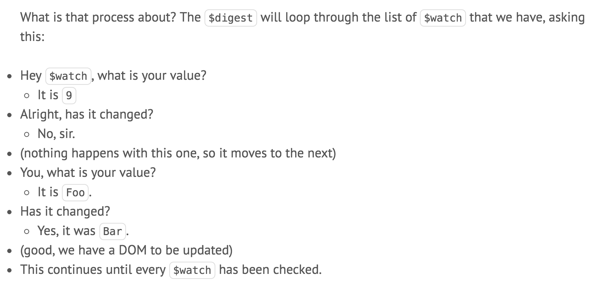
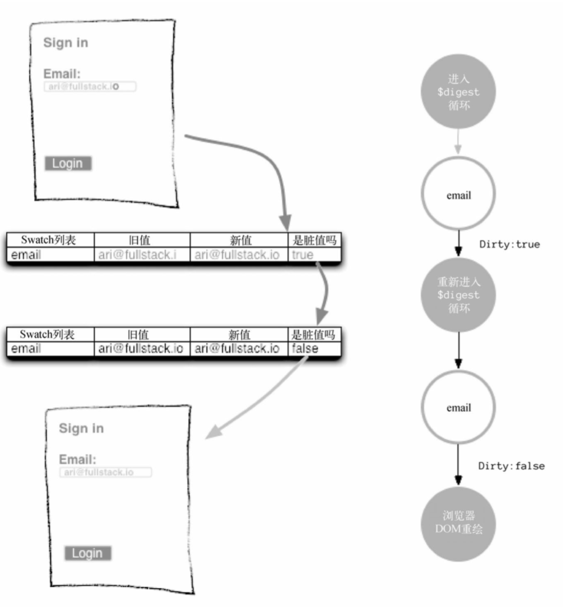
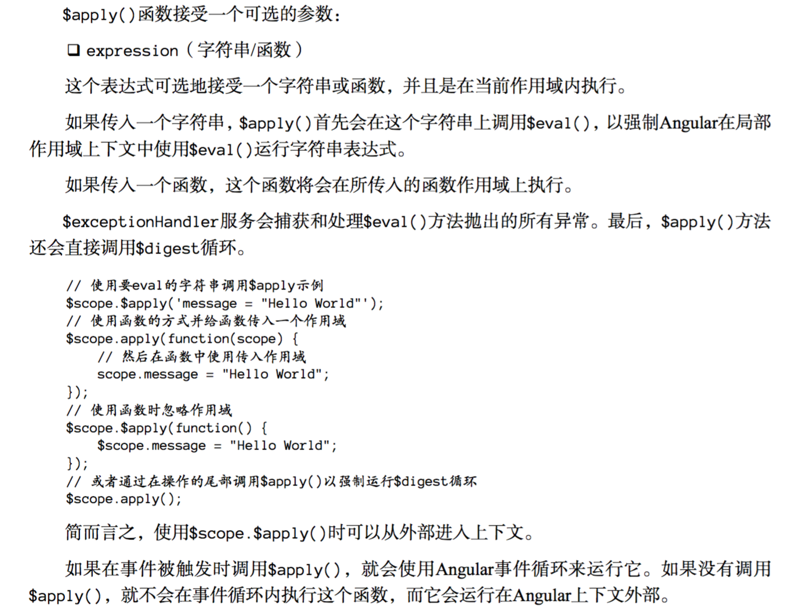

## AngularJS之$digest循环和$apply

从开始接触Angular，就一直没有把数据绑定这一块的知识学习清楚过，果然学习一定要脚踏实地。下面主要是讲$digest循环是怎么工作，以及怎么使用$apply()方法。

### $digest循环

> 在标准的浏览器流程中，当事件被触发时，浏览器会执行注册给该事件的回调函数。

> 当将Angular混入这个流程中时，它会扩展这个标准的浏览器流程，创建一个Angular上下文。这个Angular上下文指的是运行在Angular事件循环内的特定代码，该Angular事件循环通常被称作$digest循环。

> $digest循环有两个主要组成部分：$watch列表、$evalAsync列表

##### $watch列表

每次绑定一个$scope属性到UI上时，就会往`$watch列表`中插入一条`$watch`。而这条`$watch`就是可以检测它监视的`model`的变化。

如下：

**index.html**

```
User: <input type="text" ng-model="user" />
Password: <input type="password" ng-model="pass" />
```

此时，`$watch列表`中有两条`$watch`，分别用来监控`$scope.user`和`$scope.pass`。

如下：

**ctrl.js**

```
app.controller('MainCtrl', function($scope) {
  $scope.foo = "Foo";
  $scope.world = "World";
});
```

**index.js**

```
Hello, {{ World }}
```

此时，虽然在controller中在$scope上添加了两个变量，但是只有`world`变量绑定到了UI元素上，因此，`$watch列表`中只有一条`$watch`，用来监控`$scope.world`。

如下：

**index.html**

```
<ul>
	<li ng-repeat="person in people">
    	{{person.name}} - {{person.age}}
    </li>
</ul>
```

此时，使用了`ng-repeat`指令生成了一个列表，这里又生成了多少个`$watch`呢？每个person有两个（一个name，一个age），`ng-repeat`指令本身一个，所以如果people有10个person，则`$watch列表`中会有（2*10+1）= 21条`$watch`。

因此，每一个绑定到UI上的数据都会生成一个`$watch`。

**注意：**

> 对于所有绑定给同一个$scope对象的UI元素，只会添加一个`$watch`到`$watch列表`中。

**`$watch`什么时候创建的？**

> When our template is loaded, AKA in the linking phase, the compiler will look for every directive and creates all the $watch that are needed. 

当我们的模版加载完毕时，也就是在linking阶段（Angular分为compile阶段和linking阶段），Angular解释器会寻找每个directive，然后生成每个需要的`$watch`。

这些`$watch列表`会在`$digest循环`中通过**脏值检查**的程序解析。

##### 脏值检查

> 检查值是否发生了变化，而整个应用还没同步该变化。



`dirty-checking`的过程就是上面所描述的那样。

Angular应用持续跟踪当前监控的值。Angular会遍历`$watch列表`，如果从旧值更新后的值没有发生变化，它会继续遍历监控列表。如果值发生变化，该应用会启用新值并继续遍历`$watch列表`，如下图：



从上图可以知道，Angular遍历完整个$watch列表，只要有任何值发生变化，应用将会重新进入`$digest循环`中，直到检测到不再有任何变化。

为什么要再次运行`$digest循环`？因为如果更新了`$watch列表`中某个用于更新另一个值得值，Angular将检测不到更新，除非再次运行循环。如果这个循环运行10次或者更多次，Angular应用会抛出一个异常，防止无限循环。当`$digest循环`结束时，DOM相应的发生变化。

> 每一个进入Angular上下文（`Angular context`）的事件都会执行一个`$digest循环`。而每进入一个循环都会要遍历整个页面的所有`$watch`

### $apply

> `$apply()`函数可以从Angular框架的外部让表达式在Angular上下文内部执行。

> 通常可以依赖于Angular提供的可用于视图中的任意指令来调用`$apply()`。所有的`ng-[event]`指令（比如`ng-click`）都会调用`$apply()`。

如果使用第三方库或者使用一个`setTimeout()`并且想让事件运行在Angular上下文内部时，就必须使用`$apply()`。




### 参考

[理解$watch ，$apply 和 $digest --- 理解数据绑定过程](http://www.angularjs.cn/A0a6)

[$watch How the $apply Runs a $digest](http://angular-tips.com/blog/2013/08/watch-how-the-apply-runs-a-digest/)

《AngularJS权威教程》


