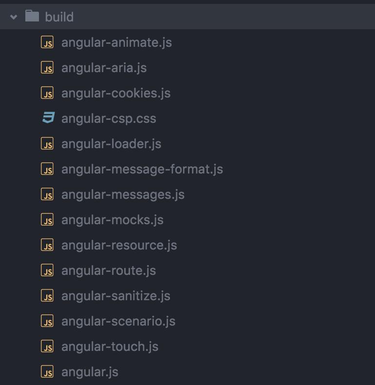

## 源码目录结构说明

要开始学习Angular源码啦，希望自己能好好坚持~~~

基本信息：

* 版本：1.4.x
* node版本：0.10.17

是学习未编译合并前的代码，学习前的准备：

* 下载源码：`git clone https://github.com/angular/angular.js.git`
* 切换分支，v1.4.x
* 确保当前环境node、grunt、bower都已安装好，`sudo npm install -g grunt-cli`，`sudo npm install -g bower`
* 安装nodejs依赖：`npm install`
* 安装js依赖：`bower install`
* 编译：`grunt build`
* 单元测试：`grunt test:unit`
* 端到端测试：`grunt package` `grunt test:e2e`

### 开始学习

angular的编译合并以及测试使用的是Grunt框架，所以我们从`Gruntfile.js`文件开始学习。

在文件的刚开始，引入了两个文件，如下：

```
var files = require('./angularFiles').files;
var util = require('./lib/grunt/utils.js');
```

找到这两个文件，分别进行学习。

#### angularFiles.js

```
'use strict';

var angularFiles = {
  'angularSrc': [...],

  'angularLoader': [...],

  'angularModules': {
    'ngAnimate': [...],
    'ngCookies': [...],
    'ngMessageFormat': [...],
    'ngMessages': [...],
    'ngResource': [...],
    'ngRoute': [...],
    'ngSanitize': [...],
    'ngMock': [...],
    'ngTouch': [...],
    'ngAria': [...]
  },

  'angularScenario': [...],

  'angularTest': [...],

  'karma': [...],

  'karmaExclude': [...],

  'karmaScenario': [...],

  "karmaModules": [...],

  'karmaJquery': [...],

  'karmaJqueryExclude': [...]
};

angularFiles['angularSrcModules'] = [].concat(
  angularFiles['angularModules']['ngAnimate'],
  angularFiles['angularModules']['ngMessageFormat'],
  angularFiles['angularModules']['ngMessages'],
  angularFiles['angularModules']['ngCookies'],
  angularFiles['angularModules']['ngResource'],
  angularFiles['angularModules']['ngRoute'],
  angularFiles['angularModules']['ngSanitize'],
  angularFiles['angularModules']['ngMock'],
  angularFiles['angularModules']['ngTouch'],
  angularFiles['angularModules']['ngAria']
);

if (exports) {
  exports.files = angularFiles;
  exports.mergeFilesFor = function() {
    ...
  };
}

```

这个文件定义了两部分，一个`files`数组和一个`mergeFilesFor`函数。

* files是一个每个元素都是一个文件名的数组，将所有Angular的源码分组追踪起来了。
* mergeFilesFor函数用于合并files中的元素。

#### lib/grunt/utils.js

在讲`lib/grunt/utils.js`文件之前，先看看在`Gruntfile.js`文件中哪里用到了这个文件。通过阅读源码发现，在`build`任务中使用的很平凡，代码如下：

```
build: {
  scenario: {
    dest: 'build/angular-scenario.js',
    src: [
      'bower_components/jquery/dist/jquery.js',
      util.wrap([files['angularSrc'], files['angularScenario']], 'ngScenario/angular')
    ],
    styles: {
      css: ['css/angular.css', 'css/angular-scenario.css']
    }
  },
  angular: {
    dest: 'build/angular.js',
    src: util.wrap([files['angularSrc']], 'angular'),
    styles: {
      css: ['css/angular.css'],
      generateCspCssFile: true,
      minify: true
    }
  },
  loader: {
    dest: 'build/angular-loader.js',
    src: util.wrap(files['angularLoader'], 'loader')
  },
  touch: {
  	dest: 'build/angular-touch.js',
    src: util.wrap(files['angularModules']['ngTouch'], 'module')
  },
  mocks: {...},
  sanitize: {...},
  resource: {...},
  messageformat: {...},
  messages: {...},
  animate: {...},
  route: {...},
  cookies: {...},
  aria: {...},
  'promises-aplus-adapter': {
  	dest:'tmp/promises-aplus-adapter++.js',
    src:['src/ng/q.js', 'lib/promises-aplus/promises-aplus-test-adapter.js']
  }
}
```

可以发现，`build`任务中使用了`util.wrap()`方法，去`lib/grunt/utils.js`文件找到`util.wrap()`方法，如下：

```
wrap: function(src, name){
  src.unshift('src/' + name + '.prefix');
  src.push('src/' + name + '.suffix');
  return src;
}
```

在`build`任务中调用的`util.wrap()`方法中的`src`参数是`angularFiles.js`文件中的`angularFiles`对象中对应字段所指向的数据。而`util.wrap()`方法就是在`src`参数所指向的数组的第一个元素前和最后一个元素后分别插入一个元素。从`build`任务的代码中可以知道有如下四种情况：

* 添加`src/ngScenario/angular.prefix`，`src/ngScenario/angular.suffix`
* 添加`src/angular.prefix`，`src/angular.suffix`
* 添加`src/loader.prefix`，`src/loader.suffix`
* 添加`src/module.prefix`，`src/module.suffix`

**处理前：**

```
'angularSrc': [
    'src/minErr.js',
    'src/Angular.js',
    'src/loader.js',
    'src/stringify.js',
    'src/AngularPublic.js',
    'src/jqLite.js',
    'src/apis.js',
    ...
    'src/ngLocale/angular-locale_en-us.js'
]
```

**处理后：**

```
'angularSrc': [
	'src/angular.prefix',  // util.wrap()方法添加的前缀元素
	
    'src/minErr.js',
    'src/Angular.js',
    'src/loader.js',
    'src/stringify.js',
    'src/AngularPublic.js',
    'src/jqLite.js',
    'src/apis.js',
    ...
    'src/ngLocale/angular-locale_en-us.js'
    
    'src/angular.suffix'   // util.wrap()方法添加的后缀元素
]
```

那么，为什么需要做这个处理呢？之前有说，`angularFiles`每个元素都是一个文件名，所以可以知道添加的前缀和后缀也都分别是文件名。找到这些文件，以`src/angular.prefix`，`src/angular.suffix`为例，如下：

**src/angular.prefix**

```
/**
 * @license AngularJS v"NG_VERSION_FULL"
 * (c) 2010-2015 Google, Inc. http://angularjs.org
 * License: MIT
 */
(function(window, document, undefined) {
```

**src/angular.suffix**

```
  jqLite(document).ready(function() {
    angularInit(document, bootstrap);
  });

})(window, document);
```

可以发现，两个文件正好构成一个自行执行的匿名函数。

ok，现在大概理解了为什么要添加这些前缀和后缀了。但是要真正能够形成一个自执行的匿名函数，需要把这些文件进行合并，这部分的实现就是在`lib/grunt/utils.js`文件中的`build`函数，如下：

```
build: function(config, fn){
  var files = grunt.file.expand(config.src);
  var styles = config.styles;
  var processedStyles;
  //concat
  var src = files.map(function(filepath) {
    return grunt.file.read(filepath);
  }).join(grunt.util.normalizelf('\n'));
  //process
  var processed = this.process(src, grunt.config('NG_VERSION'), config.strict);
  if (styles) {
    processedStyles = this.addStyle(processed, styles.css, styles.minify);
    processed = processedStyles.js;
    if (config.styles.generateCspCssFile) {
      grunt.file.write(removeSuffix(config.dest) + '-csp.css', CSP_CSS_HEADER + processedStyles.css);
    }
  }
  //write
  grunt.file.write(config.dest, processed);
  grunt.log.ok('File ' + config.dest + ' created.');
  fn();

  function removeSuffix(fileName) {
    return fileName.replace(/\.js$/, '');
  }
}
```

运行`grunt build`，编译成功后，在项目根目录下的`build`文件中可以看到编译后的文件，如下：

</img>

点开`angular.js`文件，可以发现文件开头和结尾与`src/angular.prefix`，`src/angular.suffix`两个文件的内容一样。


就这样，angular的`build`过程基本了解，同事也知道angular是把源码分组进行了管理和追踪的。

### 代码目录结构（src目录）

```
.
├── Angular.js				// 主要定义angular的工具函数
├── AngularPublic.js			// 定义了angular导出的函数和变量
├── angular.bind.js			// 判断是否已经加载了jQuery，如果是，直接使用jQuery，而不使用jqLite
├── angular.prefix			// util.wrap()方法加入的前缀代码
├── angular.suffix			// util.wrap()方法加入的后缀代码
├── apis.js					// 定义了关于对象hash值的几个函数
├── auto
│   └── injector.js			// 依赖注入和模块加载
├── jqLite.js					// 定义jqLite,一个mini的jQuery
├── loader.js					// 定义了setupModuleLoader函数
├── loader.prefix				// util.wrap()方法加入的前缀代码
├── loader.suffix				// util.wrap()方法加入的后缀代码
├── minErr.js					// 错误处理
├── module.prefix				// util.wrap()方法加入的前缀代码
├── module.suffix				// util.wrap()方法加入的后缀代码
├── ng						// 定义angular的各种服务的目录，该目录下一个文件按名字对应一个服务
│   ├── anchorScroll.js
│   ├── animate.js
│   ├── animateCss.js
│   ├── animateRunner.js
│   ├── browser.js
│   ├── cacheFactory.js
│   ├── compile.js
│   ├── controller.js
│   ├── cookieReader.js
│   ├── directive				// 指令目录，该目录下一个文件对应一个angular指令
│   ├── document.js
│   ├── exceptionHandler.js
│   ├── filter  				// 过滤器目录，该目录下一个文件对应一个过滤器
│   ├── filter.js
│   ├── forceReflow.js
│   ├── http.js
│   ├── httpBackend.js
│   ├── interpolate.js
│   ├── interval.js
│   ├── locale.js
│   ├── location.js
│   ├── log.js
│   ├── parse.js
│   ├── q.js
│   ├── raf.js
│   ├── rootElement.js
│   ├── rootScope.js
│   ├── sanitizeUri.js
│   ├── sce.js
│   ├── sniffer.js
│   ├── templateRequest.js
│   ├── testability.js
│   ├── timeout.js
│   ├── urlUtils.js
│   └── window.js
├── ngAnimate
├── ngAria
├── ngCookies
├── ngLocale
├── ngMessageFormat
├── ngMessages
├── ngMock
├── ngResource
├── ngRoute
├── ngSanitize
├── ngScenario
├── ngTouch
├── publishExternalApis.js
└── stringify.js			// 定义了对象序列化serializeObject，和对象调试输出字符串serializeObject
```

上面目录结构中有一些文件还没有仔细学习，后续将要根据这个目录结构进行学习。

### 参考

[angular源码分析：angular的源代码目录结构说明](http://www.cnblogs.com/web2-developer/p/angular-4.html)